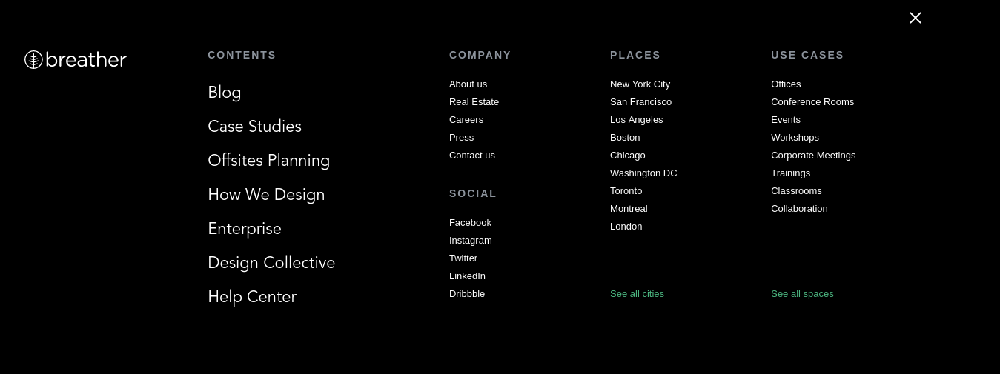
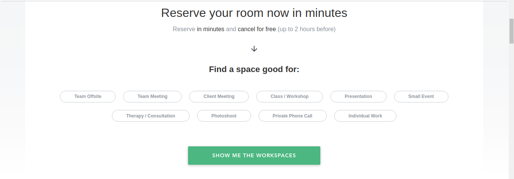
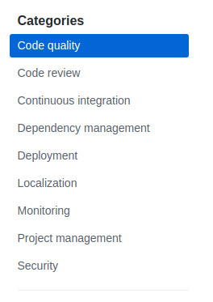
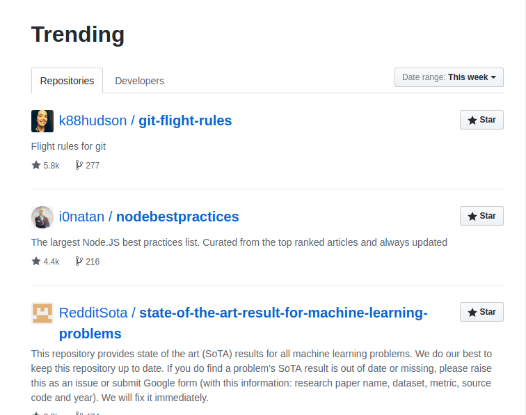
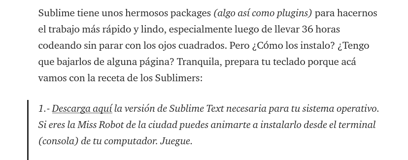

## Elementos de Navegación

#### Objetivo:
Identificar los elementos de navegación de las páginas __Breather__, __Github__ y __Medium__.

### BREATHER
La barra de navegación fija de este sitio y el menú de hamburguesa que aparece al hacer click en "menu" corresponden a navegación global.
  

También existe una sección que corresponde a navegación facetada, pues contiene filtros predefinidos que nos permiten acceder a resultados en distintas categorías.

Luego hay una sección en donde se le explica a los nuevos usuarios cómo utilizar el sitio. Esto es navegación suplementaria.
    

### GITHUB
La barra de navegación superior de Github corresponde a la navegación global.
  

Cuando uno entra en la sección "Marketplace", puede encontrar una sección que corresponde a la navegación facetada, pues contiene filtros preestablecidos para buscar herramientas que ayuden a programar mejor.

En la sección "Explore" podemos encontrar recomendaciones de repositorios basados en distintos criterios. Esto corresponde a navegación contextual.

### MEDIUM
Medium contiene una barra de navegación principal en la parte superior (barra fija) que nos permite acceder al resto del sitio; esto corresponde a navegación global.

Al entrar a cada sección, podemos encontrar artículos recomendados en base a su popularidad. Esto es navegación contextual.

En cada artículo podemos encontrar ítems de navegación en línea cuando el autor señala un enlace externo.

